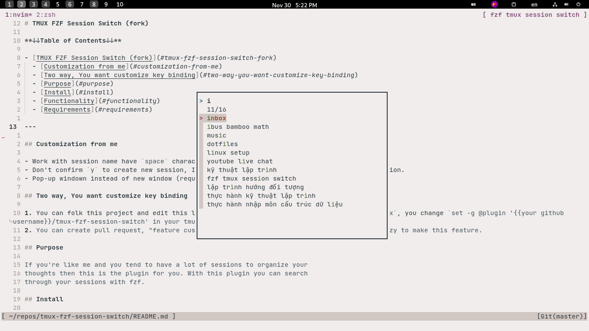

↖️ (Feeling lost? Use the GitHub TOC!)

# TMUX FZF Session Switch (fork)



## Customization from me

- Work with session name have `space` character. e.g. "Thuan Pham is handsome"
- Don't confirm `y` to create new session, I just lazy press 2 time `Enter` to create new session.
- Pop-up windown instead of new window (required tmux >= v3.2)

> Use in command line

```bash
function tmuxSessionSwitch() {
  local session
  session=$(tmux list-sessions -F "#{session_name}" | fzfDown)
  tmux switch-client -t "$session"
}
alias af='tmuxSessionSwitch'
```

> fzfDown is my customize fzf ui, you can simply use fzf instead of fzfDown

```bash
fzfDown() { fzf --height 50% --min-height 20 --bind ctrl-/:toggle-preview "$@" --reverse }
```

```bash
function killAllUnnameTmuxSession() {
  echo "kill all unname tmux session"
  cd /tmp/
  tmux ls | awk '{print $1}' | grep -o '[0-9]\+' >/tmp/killAllUnnameTmuxSessionOutput.sh
  sed -i 's/^/tmux kill-session -t /' killAllUnnameTmuxSessionOutput.sh
  chmod +x killAllUnnameTmuxSessionOutput.sh
  ./killAllUnnameTmuxSessionOutput.sh
  cd -
  tmux ls
}
```

> use with `clear` command is the best

```
alias clear='killAllUnnameTmuxSession ; clear -x'
```

## Two way, You want customize key binding

1. You can folk this project and edit this line `default_key_bindings_goto="C-f"` in `main.tmux`, you change `set -g @plugin '{{your github username}}/tmux-fzf-session-switch' in your tmux config
2. You can create pull request, "feature custom keybinding" is good too 😁 cuz I'm noob and lazy to make this feature.

## Purpose

If you're like me and you tend to have a lot of sessions to organize your
thoughts then this is the plugin for you. With this plugin you can search
through your sessions with fzf.

## Install

- Install this <https://github.com/tmux-plugins/tpm>
- Put `set -g @plugin 'thuanpham2311/tmux-fzf-session-switch' into your tmux config
- Use tpm install plugin. Default you can press `prefix + I` (`I` is `shirt + i` = I)
- Finally. `Hold ctrl -> press a -> press f`
  > my prefix is `ctrl + a`

## Functionality

- `Prefix + `: Open up fzf in a new tab. (e.g. prefix = ctrl + a. Hold ctrl -> press a -> press f -> done)
- If you type a name that doesn't exist, you will be prompted to create it.

## Requirements

- [fzf](https://github.com/junegunn/fzf)
- rg (recommended but not required)
