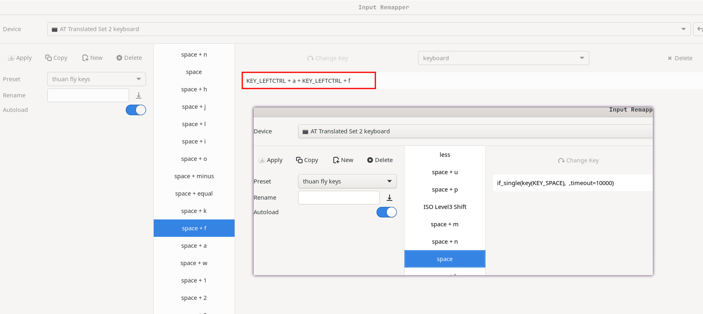

↖️ (Feeling lost? Use the GitHub TOC!)

# TMUX FZF Session Switch (fork)


## Install

- Install the [tpm](https://github.com/tmux-plugins/tpm) Tmux Plugin Manager.
- Put `set -g @plugin 'thuanOwa/tmux-fzf-session-switch'` into your tmux config
- Use tpm to install this plugin. Default you can press `prefix + I` (`I` is
  `shift + i` = I)
- Finally activate the session switcher: `prefix` followed by `C-f` (control +
  f)

## Customize key binding

```bash
# tmux.conf

set -g @fzf-goto-session 'key binding'
```

to override the default session switcher in tmux avilable at `prefix + s`:

```bash
set -g @fzf-goto-session 's'
```

## Functionality

- `Prefix +`: Open up fzf in a new tab. (e.g. prefix = ctrl + a. Hold ctrl ->
  press a -> press f -> done)
- If you type a name that doesn't exist, you will be prompted to create it.

## Requirements

- [fzf](https://github.com/junegunn/fzf)
- rg (recommended but not required)

## Customization from me + tips

- Work with session name have `space` character. e.g. "Thuan Pham is handsome"
- Don't confirm `y` to create new session, I just lazy press 2 time `Enter` to
  create new session.
- Pop-up windown instead of new window (required tmux >= v3.2)

> Use in command line

```bash
function tmuxSessionSwitch() {
  local session
  session=$(tmux list-sessions -F "#{session_name}" | fzfDown)
  tmux switch-client -t "$session"
}
alias af='tmuxSessionSwitch'
```

> fzfDown is my customize fzf ui, you can simply use fzf instead of fzfDown

```bash
fzfDown() { fzf --height 50% --min-height 20 --bind ctrl-/:toggle-preview "$@" --reverse }
```

```bash
function killAllUnnameTmuxSession() {
  echo "kill all unname tmux session"
  cd /tmp/
  tmux ls | awk '{print $1}' | grep -o '[0-9]\+' >/tmp/killAllUnnameTmuxSessionOutput.sh
  sed -i 's/^/tmux kill-session -t /' killAllUnnameTmuxSessionOutput.sh
  chmod +x killAllUnnameTmuxSessionOutput.sh
  ./killAllUnnameTmuxSessionOutput.sh
  cd -
  tmux ls
}
```

> use with `clear` command is the best

```
alias clear='killAllUnnameTmuxSession ; clear -x'
```

- In my use case i don't use this keybinding for switch session, i use
  `hold space + f` mapping for `hold Ctrl + a + f`, how can i use
  `hold space + f` mapping? -> i use
  [input remapper](https://github.com/sezanzeb/input-remapper), also you can see
  [my dotfiles](https://github.com/thuanOwa/dotfiles)


